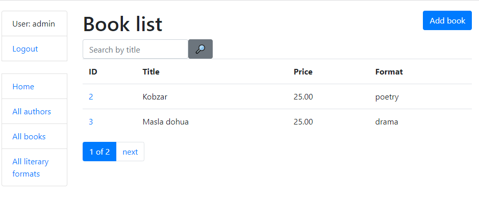

# Library Project

Django project for managing books and authors in Library

## Check it out!

[Library project deployed to Heroku](PASTE_LINK_HERE)

## Installation

Python3 must be already installed

```shell
git clone https://github.com/DHushchyk/library.git
cd library
python3 -m venv venv
source venv/bin/activate
pip install -r requirements.txt
python manage.py runserver
```

## Features

* Authentication functionality for Admin/User
* Managing books authors & literary formats directory from website
* Powerful admin panel for advanced managing

## Demo

